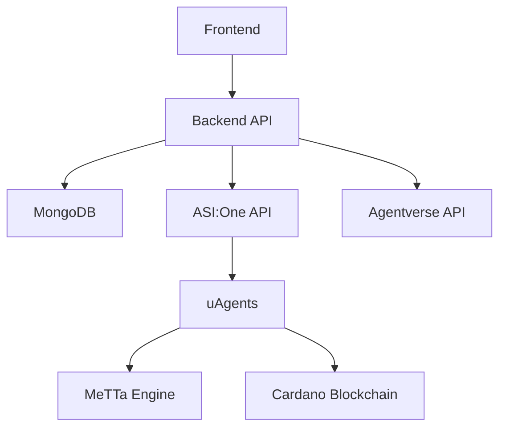

# Hakika Architecture

## High-Level Overview
Hakika follows a microservices-like architecture with decoupled frontend, backend, and agent layers for scalability and hackathon agility.

### Components
1. **Frontend (React SPA)**:
   - User interface for social feeds, niches, verification games.
   - Integrates Web3 wallets (Cardano) for auth.
   - Communicates with backend via REST/WebSockets.

2. **Backend (Node.js/Express)**:
   - API server handling CRUD for posts, users, verification.
   - Database: MongoDB for flexible schema.
   - Integrates with external APIs (ASI:One, Agentverse).

3. **Agent Layer (uAgents/Python)**:
   - Autonomous agents for verification workflows.
   - Triggered by backend; perform on-chain actions.

4. **Blockchain (Cardano)**:
   - Smart contracts for reputation NFTs and logs.
   - Integrated via Mesh SDK.

### Data Flow
1. User posts content via frontend → Backend saves to DB.
2. Backend triggers agents → ASI:One analyzes, MeTTa verifies.
3. Agents reach consensus → Update DB and on-chain.
4. Frontend polls for real-time updates.

### Security
- Web3 auth prevents centralized control.
- Agent consensus reduces single points of failure.
- IPFS for media storage.

### Scalability
- Docker containers for easy deployment.
- Horizontal scaling for agents via Bureau.

## Diagrams

## References
- Based on Fetch.ai ecosystem.
- Hackathon focus: Agentic on-chain interactions.
